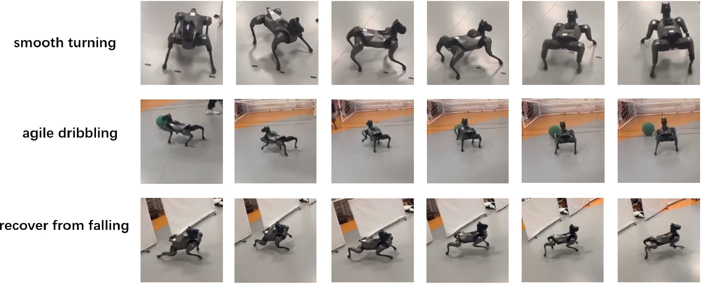
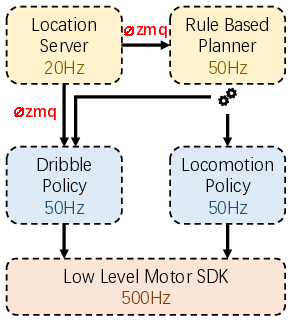

# Flexible Framework for Agile Dribbling with Cyberdog2

This project implements a flexible framework for agile dribbling using the Cyberdog2 quadruped robot. We utilize reinforcement learning techniques to train effective control policies for locomotion and dribbling tasks, addressing key challenges in sim-to-real transfer.

We release our trained controller checkpoint in `dribblebot-deploy/ckpt`.

<p align="center">
  
</p>

## Get Started

Run the following commands to install the required dependencies:

```bash
pip install -e robot_interface
```

To run the dribbling environment, first start the location server and robot data server:

```bash
python dribblebot-deploy/location_server.py
python dribblebot-deploy/robot_server.py
```

then execute the following command:

```bash
python dribblebot-deploy/dribble_env.py
```


## Project Structure

<p align="center">
  
</p>


The project is organized into several key directories:

- `cyberdog_motor_sdk/`: Low-level motor SDK for Cyberdog2, forked from [MiRoboticsLab](https://github.com/MiRoboticsLab/cyberdog_motor_sdk).

- `dribblebot-deploy/`: Houses the main deployment code for the dribbling functionality. Key files include:
  - `location_server.py`: Connects to upstream machine for visual detection and localization of robot and ball.
  - `robot_data_server.py`: Listens to lcm message and relay the data through zmq.
  - `dribble_env.py` and `dribble_env_latest.py`: Implements the dribbling environment, including observation/action conversion and main loop control.
  - `loco_env.py`: Implements the locomotion environment.
  - `soccer_env.py`: Implements the overall soccer environment.

- `robot_interface/`: Provides the interface between the high-level Python code and the low-level C++ motor SDK:

- `examples/`: Contains example scripts demonstrating basic usage of the `robot_interface` package:
  - `example_read.py`: Shows how to read data from the robot.
  - `example_stand.py`: Demonstrates making the robot stand.

## Measures to Mitigate Sim-to-Real Gap

- Inference frequency optimization using half-precision (fp16) inference
- Default pose adjustment for improved dribbling
- Location server delay modeling
- PD control parameter tuning
- Locomotion gait simplification
- Reward scale adjustment for better velocity tracking


## Contributing

We welcome contributions to this project. Please feel free to submit issues and pull requests.

## Acknowledgments

This project builds upon several open-source projects and research papers:

- DribbleBot
- Walk These Ways
